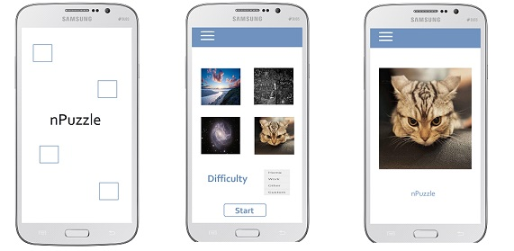

# Design Document

### Classes and public methods

The design will contain a minimum of three classes, the number of which can be increased later if convenient. The classes that will be implemented in seperate activities are:

- SplashScreenActivity: This class will be called on create, so when the app is opened it will show an intro image or animation.
    - onCreate: Shows image/animation of the app for 3 seconds
- SetupActivity: This class will be active after the intro screen/animation is done (after a few seconds). Here the player can choose the difficulty and picture for the puzzle.
    - onCreate: Sets adapter for spinner to choose difficulty. Sets onClickListener for start button.
    - makePictureTable: Makes a table and adds the puzzle pictures and onClickListeners, returns nothing
    - selectImage: Makes the other pictures a little transparent after onClickListener on a picture, returns nothing
- GameActivity: This class will be called with input parameters difficulty and picture. Here first the solution of the chosen puzzle is shown for a few seconds, then the puzzle is presented.  The player can make moves by clicking the tile that needs to be moved. 
    - onCreate: Shows solution picture for 3 seconds then shows grid for the puzzle
    - createImages: Divides the picture into tiles according to given difficulty and picture
    - onTileClick: if the tile is next to the empty tile, calls switchTiles
    - switchTiles: switches the location of the two given tiles
    - checkCompletion: Checks if the tiles are arranged as the solution, if the game is won a winner screen is shown, returns nothing
- ChangeDifficultyActivity: Can be called during the game and gives an option to change the difficulty, then restarts the game
    - onCreate: Shows a dialog screen with the spinner to change the difficulty. Shows a Choose button and a Return button. If the Return button is chosen, the dialog screen dissapears without changing the game. If the Choose button is chosen, the game restarts with the chosen difficulty.
- WinnerActivity: Shows a picture/animation if the puzzle is solved
    - onCreate: Shows the picture/animation for 4 seconds, then shows  a button to return to setupActivity and a button to quit
    
### API's and frameworks

- android.widget: for the use of Buttons, TextViews, Imageviews, Layouts etc.
- android.view: necessary library to make use of any views (see above)
- android.content: to switch between activities
- handlers: to delay codes

### Design sketches

